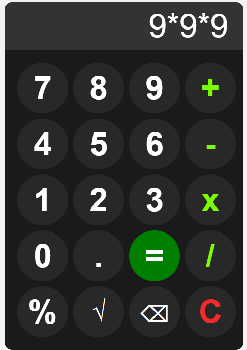

# 📟Calculator

A simple and interactive calculator built using **HTML**, **CSS**, and **JavaScript**.
This project allows users to perform basic math operations with a clean and responsive design. It demonstrates essential JavaScript concepts like DOM manipulation, event handling, and dynamic UI updates.

---

## 🎯Features

- 🔢 Basic arithmetic operations (Addition, Subtraction, Multiplication, Division, Percentage)
- 📐 Square root calculation
- 🔁 Backspace function to remove last input
- 🧼 Clear (`C`) to reset the display
- 🟰 Equal (`=`) button to evaluate the expression
- ❌ Displays Error for invalid expressions
- 🧮 Handles Multi-Digit and Decimal Inputs: Allows decimal points and long mathematical expressions
- 🎨 Dark-theme with smooth button hover and click effects
- 📱 Responsive layout suitable for all screen sizes

---

## ✅Concepts Used

- JavaScript DOM Manipulation(`getElementById`, `value`, `eval`, `Math.sqrt`)
- Arithmetic evaluation using eval() and Math.sqrt()
- Button click event handling using onclick
- Input evaluation with error handling(try...catch)
- Responsive CSS **Grid Layout** 
- CSS styling for hover, active, and custom button styles

---

## 🔗 Live Demo
[View Calculator Demo](https://malleswari-jonnadula.github.io/Web-dev-projects/Calculator/)

## 📸 Screenshot

## 💡 How to Use

1. Click number buttons to input digits
2. Select any operator (`+`, `-`, `×`, `/`)
3. Press `=` to calculate
4. Use `C` to clear the display, `⌫` to backspace, and `√` for square root